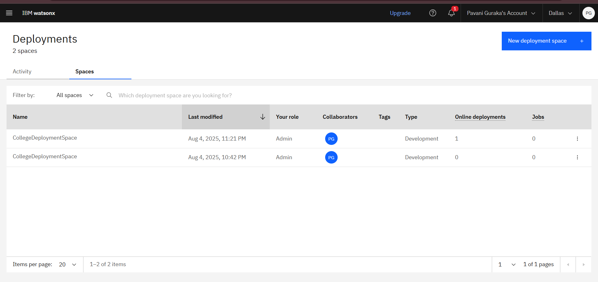

# 🎓 College Admission Agent IBM

> **RAG-based College Admission Agent using IBM Watsonx and Granite Models**

---

## 📌 Project Overview

This project implements a **college admission assistant chatbot** using IBM Watsonx's **Granite large language models** and **RAG (Retrieval-Augmented Generation)**. It answers queries related to college admissions based on curated data and documents.

---

## 🧠 Technologies Used

- ✅ IBM Watsonx
- ✅ Granite Foundation Models
- ✅ watsonx.ai Agents
- ✅ RAG (Retrieval-Augmented Generation)
- ✅ JSON, Python (internally for agents)
- ✅ IBM Cloud Storage

---

## 📁 Project Structure

---

## 🚀 How to Use

1. Go to [IBM Watsonx](https://dataplatform.cloud.ibm.com/).
2. Create a new project or import this one.
3. Use the **Export/Import** feature to load the `CollegeAdmissionAgent2.zip`.
4. Explore the agents and test them using your uploaded documents.

---

## 📸 Screenshots

| Feature | Screenshot |
|--------|------------|
| Agent UI |  |
| Data File |  |

---

## 👩‍💻 Author

**Pavani Guraka**  
IBM SkillsBuild | College Admission Assistant Project  
GitHub: [PavaniG2K5](https://github.com/PavaniG2K5)

---

## 📄 License

This project is for educational/demo purposes under IBM SkillsBuild.
